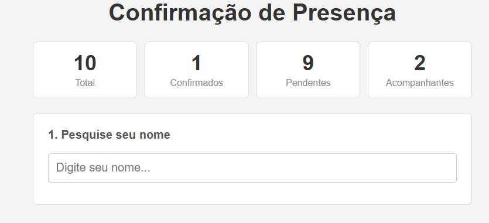
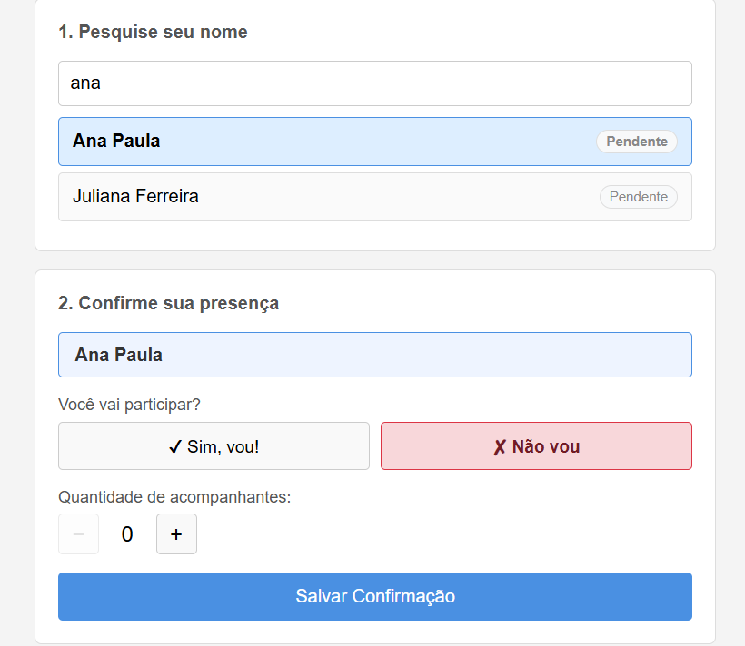
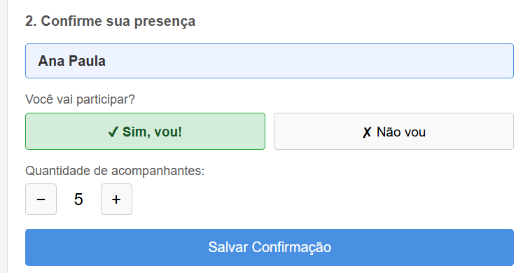
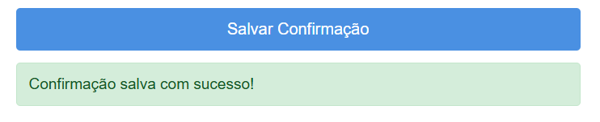

# Confirmação de Presença em Evento

Sistema web de página única (SPA) para gerenciamento de confirmação de presença em eventos. Os convidados pesquisam seu nome na lista, confirmam ou recusam presença e informam a quantidade de acompanhantes. Todos os dados são persistidos em arquivo JSON.

---

## Tecnologias Utilizadas

| Camada | Tecnologia |
|---|---|
| Servidor | [Bun](https://bun.sh) |
| Back-end | JavaScript (orientação a objetos) |
| Front-end | HTML, CSS e JavaScript puro |
| Armazenamento | Arquivo `dados.json` |

> Nenhuma biblioteca ou framework externo foi utilizado. Sem banco de dados.

---

## Instruções de Execução

### 1. Instalar o Bun

Abra o **PowerShell** e execute:

```powershell
powershell -c "irm bun.sh/install.ps1 | iex"
```

Feche e reabra o PowerShell após a instalação. Verifique:

```powershell
bun -v
```

### 2. Clonar ou baixar o projeto

Organize os arquivos na seguinte estrutura (veja seção abaixo).

### 3. Iniciar o servidor

```powershell
cd caminho\para\evento-bun
bun server.js
```

Saída esperada:
```
Servidor rodando em http://localhost:3000
```

### 4. Acessar no navegador

```
http://localhost:3000
```

### 5. Encerrar o servidor

Pressione `Ctrl + C` no terminal.

---

## Estrutura do Projeto

```
evento-bun/
│
├── server.js          # Servidor HTTP com Bun + definição das rotas
├── dados.json         # Armazenamento dos convidados
├── package.json       # Metadados do projeto
│
├── src/
│   ├── Repository.js  # Leitura e escrita no arquivo JSON
│   ├── Service.js     # Regras de negócio (busca, confirmação, estatísticas)
│   └── Controller.js  # Recebe as requisições HTTP e retorna as respostas
│
└── public/
    └── index.html     # Interface completa (HTML + CSS + JavaScript)
```

### Responsabilidade de cada arquivo

**`server.js`**
Inicializa o servidor com `Bun.serve()`, recebe todas as requisições e direciona para o controller correto conforme a rota. Também serve o arquivo `index.html` para o navegador.

**`src/Repository.js`**
Responsável exclusivamente por ler e gravar o arquivo `dados.json` usando `fs.readFileSync` e `fs.writeFileSync`. Não contém nenhuma regra de negócio.

**`src/Service.js`**
Contém toda a lógica da aplicação: busca parcial por nome, validação dos dados antes de salvar, confirmação de presença e cálculo das estatísticas.

**`src/Controller.js`**
Faz a ponte entre o servidor e o service. Recebe o objeto `Request` do Bun, extrai os dados necessários (query string ou corpo JSON) e retorna um objeto `Response`.

**`public/index.html`**
Página única da aplicação. Contém o HTML da interface, o CSS de estilização e o JavaScript que se comunica com a API via `fetch` — tudo sem recarregar a página.

**`dados.json`**
Arquivo de armazenamento. Contém a lista de convidados com nome, status de confirmação e quantidade de acompanhantes. Não deve ser editado manualmente durante o uso.

---

## Rotas da API

| Método | Rota | Descrição |
|---|---|---|
| `GET` | `/api/buscar?q=termo` | Busca convidados pelo nome (parcial) |
| `POST` | `/api/confirmar` | Salva a confirmação de um convidado |
| `GET` | `/api/estatisticas` | Retorna totais de convidados, confirmados, ausentes e acompanhantes |

### Exemplo de corpo para `/api/confirmar`

```json
{
  "nome": "Carlos Eduardo",
  "confirmado": true,
  "acompanhantes": 2
}
```

---

## Funcionalidades

- Pesquisa de convidado por nome (busca parcial — ex: "car" encontra "Carlos Eduardo")
- Seleção do nome na lista de resultados
- Confirmação ou recusa de presença
- Informar quantidade de acompanhantes (não permite valor negativo)
- Estatísticas em tempo real: total de convidados, confirmados, pendentes e acompanhantes
- Dados persistidos em `dados.json` — sobrevivem ao reinício do servidor
- Página não recarrega durante o uso (SPA com `fetch`)
- Não é possível cadastrar novos convidados pela interface

---

## Prints da Aplicação


**Tela inicial com estatísticas e campo de busca**



**Resultado da busca e seleção do convidado**



**Formulário de confirmação preenchido**



**Mensagem de sucesso após salvar**



---

## Regras do Sistema

- Nomes não podem ser alterados
- Novos convidados não podem ser cadastrados pela interface
- Acompanhantes não podem ser negativos
- Não é possível salvar sem selecionar um convidado
- Não é possível salvar sem informar se vai participar
